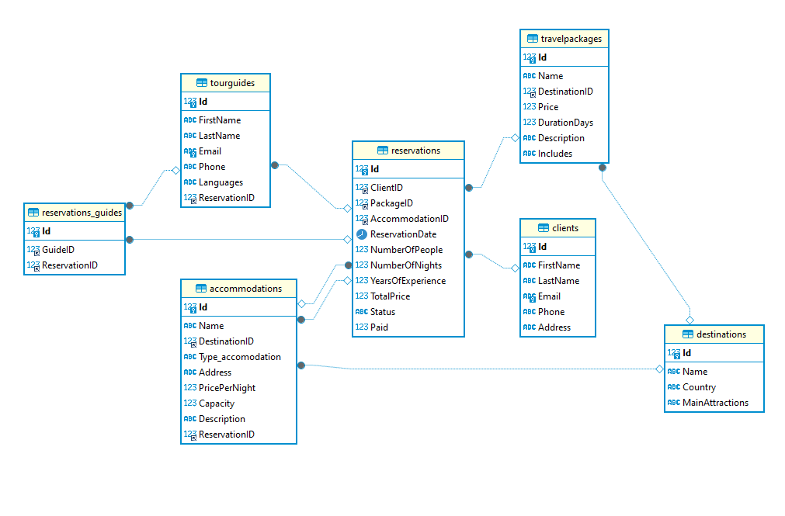

# Tourism Travel Project

## Project Description

This project has been developed by Montserrat Cobes Orteu, a technology and travel enthusiast, with the aim of creating a web platform to manage and explore tourist destinations. The application allows users to view, add, edit, and delete destinations, as well as manage travel packages, clients, accommodations, and reservations.

## Available Routes

- **`/` (GET)**: Displays the list of available tourist destinations.
- **`/add_destinations` (GET)**: Page to add a new destination.
- **`/add_destination` (POST)**: Processes the form information to add a new destination to the database.
- **`/details_destination/<int:id>` (GET)**: Displays the details of a specific destination.
- **`/details_destination/<int:id>/editar` (POST)**: Processes the form information to edit an existing destination.
- **`/details_destination/<int:id>/delete` (POST)**: Processes the deletion of a specific destination.

## ER Diagram

## Web Functionalities

- **View Destinations**: Users can view a list of all available destinations along with details such as name, country, and main attractions.
- **Add Destinations**: Users can add new destinations by filling out a form with the name, country, and main attractions.
- **Edit Destinations**: Users can update the information of existing destinations.
- **Delete Destinations**: Users can delete destinations from the database.
- **Manage Travel Packages**: Administration of travel packages associated with the destinations.
- **Manage Clients**: Maintenance of client records, including their contact information.
- **Manage Accommodations**: Administration of different types of accommodations available for each destination.
- **Manage Reservations**: Users can create, view, and manage reservations associated with clients, travel packages, and accommodations.
- **Update Reservation Prices**: Users can update the prices of reservations based on changes in travel package prices or special discounts.
- **Tour Guide Management**: Users can manage tour guides and their assignments to reservations.

### Database Justification

The database has been designed to optimize the management and relationships between different key entities: destinations, travel packages, clients, accommodations, and reservations. The structure of the database ensures referential integrity and allows for easy extension of functionality.

- **Destinations**: Main table containing information about tourist destinations.
- **TravelPackages**: Table relating travel packages to destinations.
- **Clients**: Table for storing client information.
- **Accommodations**: Table managing available accommodations in each destination.
- **Reservations**: Table handling reservations made by clients, relating them to packages and accommodations.
- **TourGuides**: Table managing information about tour guides associated with reservations.

This structure facilitates the expansion and modification of the database without compromising data integrity, ensuring efficient and flexible information management.

## Technologies Used

- **Backend**: Flask (Python)
- **Database**: MySQL
- **Frontend**: HTML, CSS